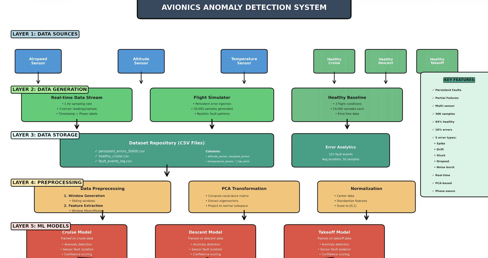

# Zairza Perception — Avionics Confidence Monitoring (FlightGear)

## Problem Statement
Modern aircraft rely on multiple sensors whose failures often develop gradually and remain undetected by traditional limit-based monitoring. This project proposes an **unsupervised, data-driven approach** that learns *normal* sensor behavior, detects subtle deviations through **residual analysis**, and converts anomaly evidence into **confidence scores** (not binary alarms). The goal is early fault detection with minimal false alarms, improving safety and maintenance planning.

Key ideas:
1. Learn what “healthy avionics” look like (no rare failure dataset required).
2. Detect slow degradation + intermittent issues that threshold checks miss.
3. Use confidence scores to preserve pilot trust (no noisy binary warnings).
4. Provide explainability: which signal/state is most degraded.
5. Keep it computationally light (signal processing + PCA).

---

## Tech Used
1. **FlightGear** simulator (live telemetry via property/telnet server).
2. **Python 3.13+** (note: `telnetlib` is removed, so we use a socket-based client).
3. **NumPy / Pandas** for buffers, features, transforms.
4. **scikit-learn** (StandardScaler + PCA) stored in `pca_*.pkl` via **joblib**.
5. **Kalman filter (1D)** for prediction and residual computation (`kalman.py`).
6. **Streamlit + Altair** for real-time dashboard (`fg_streamlit_dashboard.py`).

---

## Repository Structure (Important Files)
1. `flightgear_data.py` — simple FlightGear telemetry printout (baseline connectivity check).
2. `operation.ipynb` — original offline pipeline / experiments.
3. `operationV2.ipynb` — updated pipeline with residual normalization + coupled “state” reasoning.
4. `flightgearV2.py` — live pipeline (earlier version).
5. `flightgearV3.py` — live pipeline aligned to `operationV2.ipynb`:
   - normalized residuals
   - confidence smoothing
   - threshold-based confidence (`error_threshold`)
   - dominant degraded state/signal reasoning
   - continuous CSV flight logging
6. `fg_streamlit_dashboard.py` — real-time dashboard (confidence + raw vs smooth + residuals).
7. `control_fg_v2.py` — simple “autopilot-like” controller: takeoff + stabilize for ~15 minutes.
8. `pca_cruise.pkl`, `pca_takeoff.pkl`, `pca_descent.pkl` — trained PCA bundles (scaler, PCA, thresholds).
9. `persistent_errors_30000.csv` — generated/collected dataset used during training/validation.

---

## How The Workflow Works (End-to-End)
### 1) Live Data In
FlightGear exposes sensor values via a telnet-like property server. We query values like:
1. `/velocities/airspeed-kt`
2. `/position/altitude-ft`
3. `/environment/temperature-degc`
4. `/velocities/vertical-speed-fps`

### 2) Cleaning + Smoothing
1. **Forward fill**: if a value is missing on a tick, use the last known valid value.
2. **EWMA smoothing**: reduces jitter and noise before feature extraction.

### 3) Prediction + Residuals (Kalman)
For each signal (air/alt/temp), we use a 1D Kalman filter to predict the next expected value and compute a residual:

`residual = (window_mean - kalman_prediction) / residual_scale`

That `residual_scale` normalizes units (altitude needs different scaling than airspeed).

### 4) Feature Extraction (Windows)
We build sliding windows:
1. `W1` for smoothed statistics (mean/std)
2. `W2` for residual statistics (mean/std)

The PCA input vector is built from residual windows:
`[mean(res_air), std(res_air), mean(res_alt), std(res_alt), mean(res_temp), std(res_temp)]`

### 5) Phase-Aware PCA
We estimate flight phase (CLIMB/DESCENT/CRUISE_LOW/CRUISE_HIGH) and select the appropriate PCA bundle (`pca_*.pkl`).

### 6) Confidence Score (Instead of Binary Alarm)
We compute PCA reconstruction error and convert it to a confidence score using a threshold:
1. `score = error / error_threshold`
2. `confidence_raw = clip(1 - score, 0, 1)`
3. `confidence = ALPHA_CONF * prev + (1 - ALPHA_CONF) * confidence_raw`

So confidence changes smoothly and avoids “alarm spam”.

### 7) Explainability (Coupled State Reasoning)
Signals are grouped into “states” (coupling), e.g. altitude depends on thermal conditions:
1. `ALTITUDE_STATE`: alt + temp
2. `AIRSPEED_STATE`: air
3. `THERMAL_STATE`: temp

When confidence drops, we report:
1. dominant degraded state
2. most affected signal (by residual magnitude)

### 8) Logging + Dashboard
1. `flightgearV3.py` appends each tick to a CSV (one row per tick) so you get a complete “flight journey log”.
2. `fg_streamlit_dashboard.py` plots live charts:
   - confidence trace
   - raw vs smooth sensors
   - residual traces
   - reconstruction error

---

## Quickstart (What To Run)
### Step 0 — Start FlightGear with Telnet Enabled
Start FlightGear with the telnet/property server on port `5500`.

If your connection fails on IPv6 (`::1`), prefer IPv4:
1. Set host to `127.0.0.1` (see env vars below)
2. Verify: `Test-NetConnection -ComputerName 127.0.0.1 -Port 5500`

### Step 1 — Optional: Auto Takeoff + Stable Flight (~15 min)
Run:
```powershell
python control_fg_v2.py
```

### Step 2 — Run Live Model + CSV Logger (OperationV2 Logic)
Run:
```powershell
python flightgearV3.py
```
Stop with `Ctrl+C` — it prints where the CSV was saved.

### Step 3 — Run the Dashboard
Run:
```powershell
streamlit run fg_streamlit_dashboard.py
```

---

## Configuration (Environment Variables)
Common:
1. `FG_HOST` (default `localhost`) — often set to `127.0.0.1`
2. `FG_PORT` (default `5500`)
3. `FG_GREEN_LOGS` (`1` on, `0` off)

Logging:
1. `FG_CSV_LOG` — path/name for the flight CSV (default is timestamped file in repo)
2. `FG_CSV_FLUSH_EVERY` — how often to flush to disk (default `1`)

Model/runtime:
1. `FG_UPDATE_RATE` — sampling seconds (default `1.0`)
2. `FG_W1`, `FG_W2`, `FG_ALPHA_CONF` — window sizes + confidence smoothing

Controller:
1. `FG_FLIGHT_TIME_S` (default `900`)
2. `FG_TARGET_AIRSPEED_KT`, `FG_TARGET_ALTITUDE_AGL_FT`

Example:
```powershell
set FG_HOST=127.0.0.1
set FG_PORT=5500
set FG_CSV_LOG=flight_001.csv
python flightgearV3.py
```

---

## Reference Images
Place images in `docs/images/` and reference them in this README.

Suggested filenames:
1. `docs/images/pca_workflow.png`
2. `docs/images/system_architecture.png`

Then they will render here:




If you share more reference photos, drop them into `docs/images/` and add them in this section the same way.

